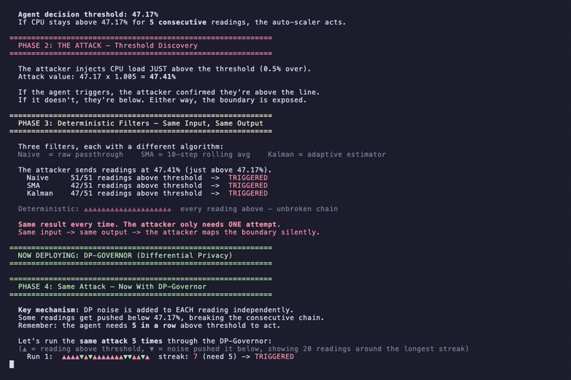

# The Paranoid Agent

**Preventing Autonomous Feedback Loop Collapse via DP-Governed Inference**

Black Hat Briefings: Supplementary PoC

---

## TL;DR

Autonomous infrastructure agents (auto-scalers, SecOps isolation bots) make threshold-breach decisions on live telemetry. An attacker who can inject small perturbations into the data stream can **discover the exact decision boundary** through slow "boiling frog" probes, then exploit it at will. Every deterministic filter (moving averages, Kalman filters) is defeated 100% of the time.

This PoC demonstrates a **Differential Privacy (DP) Governor**: a stochastic filter that makes the decision boundary probabilistic. The attacker can never be certain whether a probe will trigger the agent. Each failed probe is a **visible SOC alert**, burning the attacker's operational stealth.

**This PoC proves that Differential Privacy can be applied as a stochastic governor in control theory, not just for database queries.**

**[Read the Technical White Paper (PDF)](./whitepaper.pdf)**

---

## Demo



[Watch the full demo on YouTube](https://youtube.com/PLACEHOLDER)

---

## Key Results

| Metric | Value |
|--------|-------|
| DP-Governor latency | **0.2 ms** (4032 datapoints, vectorized numpy) |
| Spurious trigger rate | **<0.001%** on stationary telemetry (Hysteresis Gate, persistence=5) |
| Attacker probing success | **82.6%** per probe (vs 100% for all deterministic filters) |
| Per-probe failure rate | **17.4%** of probes absorbed by DP noise (Attacker Failure) |
| P(survive 5 sequential probes) | **38.5%**; each probe independently risks SOC detection, compounding geometrically |
| Ramp Time-to-Detect (TTD) | **~97 steps** (comparable across all filters, hysteresis-dominated) |
| Multi-trace consistency | DP probing 54.3%-82.6% on stationary NAB traces (EC2, ELB) |

---

## Quick Start

```bash
make install   # pip install -r requirements.txt
make run       # full evaluation: 6 plots + 2 tables (~3-5 min)
make demo      # visual terminal demo (~30 sec)
```

Or manually:

```bash
pip install -r requirements.txt
python dp_governor_poc.py          # full evaluation
python dp_governor_poc.py --demo   # terminal demo
```

The `--demo` flag bypasses all Monte Carlo simulations and runs a visual terminal simulation with color-coded ANSI output, step-by-step attack visualization, and typewriter-paced text for screen recording.

---

## Architecture

```
                    Adversarial
                     Telemetry
                         |
                         v
              +-----------------------+
              |     DP-Governor       |
              |                       |
              |  1. Clip to [lo, hi]  |
              |  2. Rolling Mean      |
              |  3. + Laplace(0, s)   |  <-- Calibrated DP noise
              +-----------------------+
                         |
                         v
              +-----------------------+
              |   Hysteresis Gate     |
              |   (5 consecutive      |
              |    breaches needed)   |
              +-----------------------+
                         |
                Trigger / No-Trigger
                         |
                         v
              +-----------------------+
              |   Agent Decision      |
              |   (Scale / Isolate)   |
              +-----------------------+
```

**Univariate:** Laplace mechanism (pure epsilon-DP). Sensitivity = (clip_hi - clip_lo) / window.

**Multivariate:** Gaussian mechanism ((epsilon, delta)-DP) on Z-score normalized features. L2-norm clipping before aggregation.

---

## Data Sources

All data is fetched live from the [Numenta Anomaly Benchmark (NAB)](https://github.com/numenta/NAB):

- `ec2_cpu_utilization_5f5533.csv`: EC2 CPU utilization
- `rds_cpu_utilization_cc0c53.csv`: RDS CPU utilization
- `elb_request_count_8c0756.csv`: ELB request count

Deterministic synthetic fallbacks are included if the network fetch fails.

---

## Output Artifacts

| File | Description |
|------|-------------|
| `assets/plot1_univariate_defense.png` | 3-panel zoomed view: full overlay, glitch zoom, ramp zoom |
| `assets/plot2_multivariate_tripwire.png` | Z-score normalized L2 norms with DP noise band |
| `assets/plot3_probing_resistance.png` | 500-trial probing histograms (the money shot) |
| `assets/plot4_epsilon_sweep.png` | Privacy budget vs probing success + burn rate |
| `assets/plot5_adaptive_attacker.png` | Adaptive attacker: time-to-detection vs time-to-evasion |
| `assets/plot6_margin_sweep.png` | Probe margin sweep [0.1% - 5%] |
| `assets/table1_metrics.csv` | Primary evaluation metrics |
| `assets/table2_multi_trace.csv` | Multi-trace robustness (3 NAB datasets) |

---

## Repository Structure

```
.
├── .gitignore
├── LICENSE
├── Makefile                        # make install / make run / make demo
├── README.md
├── requirements.txt
├── whitepaper.pdf                  # Technical white paper (pre-built with plots)
├── whitepaper.md                   # White paper source (markdown)
├── slidedeck_outline.md            # 15-slide presentation outline
├── dp_governor_poc.py              # Main PoC script (~2500 lines)
└── assets/
    ├── plot1_univariate_defense.png
    ├── plot2_multivariate_tripwire.png
    ├── plot3_probing_resistance.png
    ├── plot4_epsilon_sweep.png
    ├── plot5_adaptive_attacker.png
    ├── plot6_margin_sweep.png
    ├── table1_metrics.csv
    └── table2_multi_trace.csv
```

---

## License

MIT

---

## Citation

If you reference this work:

```
@misc{paranoid-agent-2026,
  title={The Paranoid Agent: Preventing Autonomous Feedback Loop Collapse via DP-Governed Inference},
  year={2026},
  note={Black Hat Briefings Supplementary PoC}
}
```
