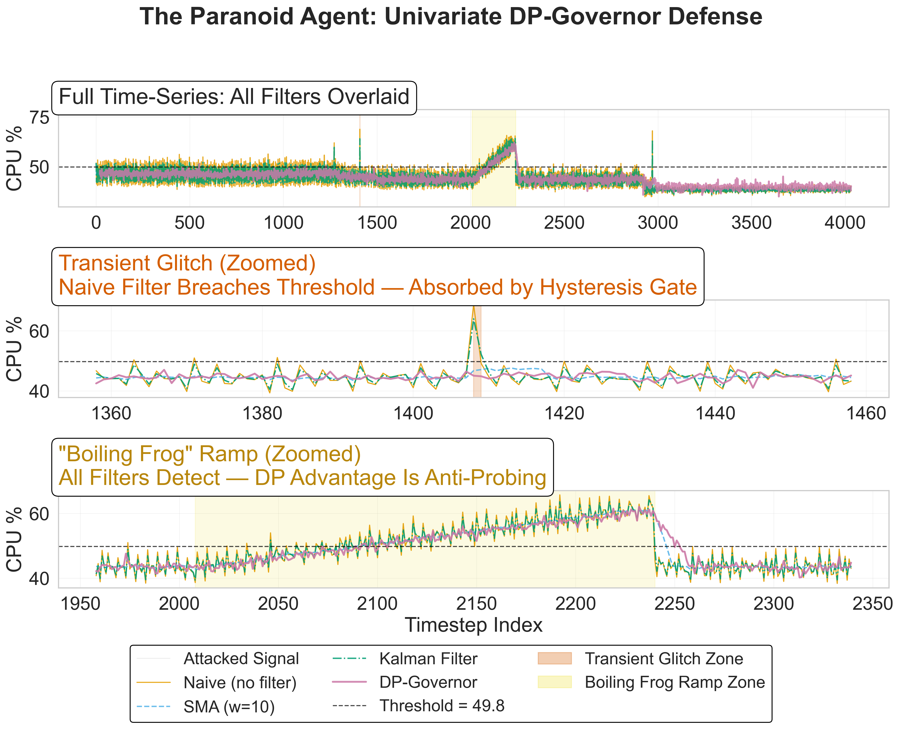
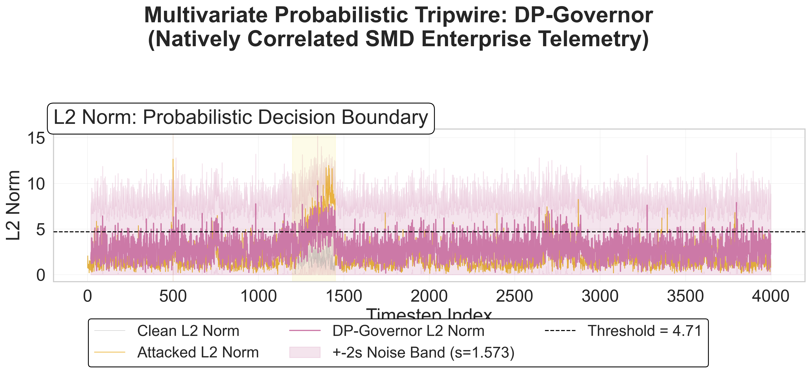
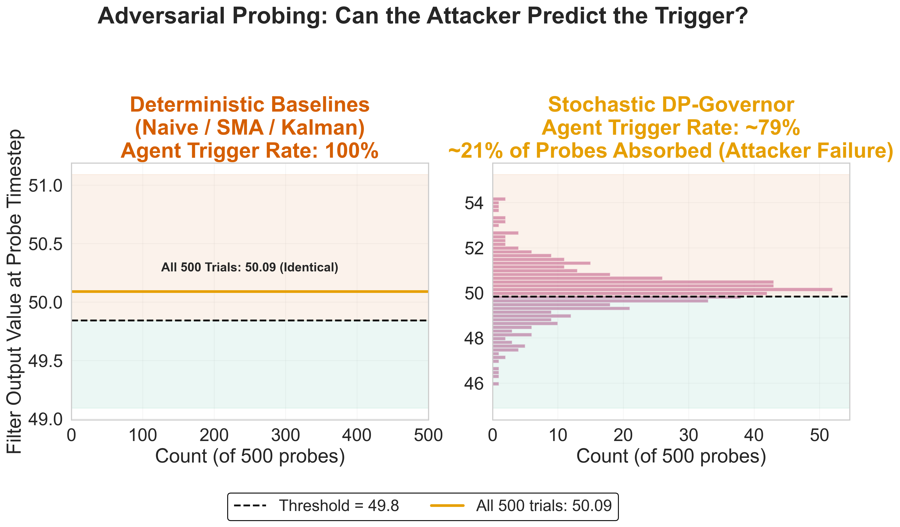
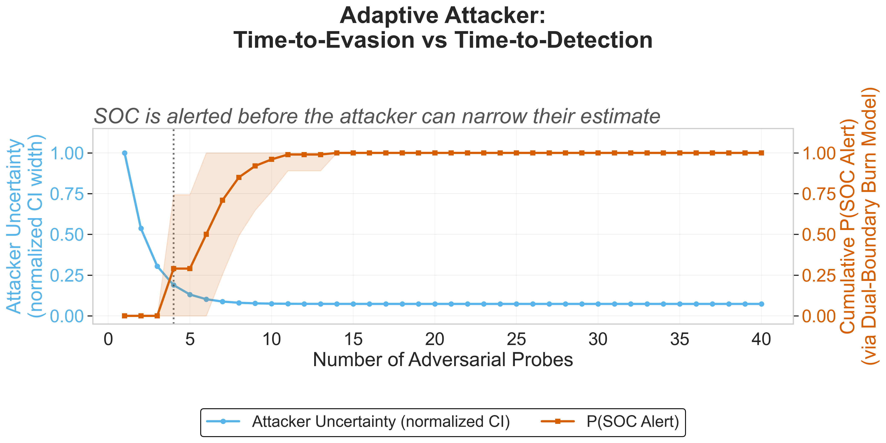
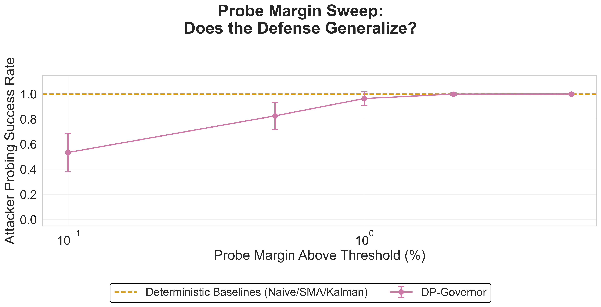
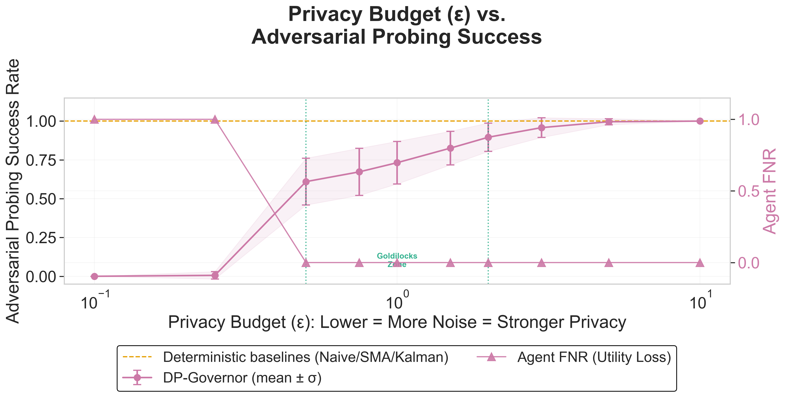

# The Paranoid Agent: Preventing Autonomous Feedback Loop Collapse via DP-Governed Inference

**Black Hat Briefings: Technical White Paper**

---

## Abstract

Every autonomous infrastructure agent (auto-scalers, SecOps isolation bots, SRE responders) makes decisions by comparing telemetry to a threshold. If that threshold is deterministic, it is extractable. We show that a patient adversary defeats every standard deterministic filter (SMA, Kalman, static margins) with 100% success rate through controlled perturbation probing. We propose the **DP-Governor**: a Differential Privacy mechanism that replaces the fixed decision boundary with a probabilistic one, simultaneously providing formal per-timestep privacy guarantees for 3rd-party telemetry consumers and imposing a geometric penalty on adversarial reconnaissance. This is a deliberate departure from traditional DP deployment: rather than bounding cumulative leakage over a static dataset, we weaponize per-timestep indistinguishability as an inline stochastic governor on stateful feedback loops; a control-theoretic application of DP that, to our knowledge, has no precedent in the infrastructure security literature.

Our evaluation on real AWS CloudWatch traces from the Numenta Anomaly Benchmark (NAB) demonstrates: 0.2ms latency overhead (~52x faster than SMA), <0.001% spurious trigger rate on stationary telemetry via a Hysteresis Gate, and a per-probe attacker failure rate of 17.4%. Under the Dual-Boundary Burn Model (§3.2), each probe independently risks SOC detection, so an attacker attempting 5 sequential probes survives undetected with probability (1 - 0.174)<sup>5</sup> ≈ 38.5%. Threshold calibration is averaged over 50 seeds to eliminate single-draw dependence. All agent parameters are derived strictly from a chronological 25% burn-in split to prevent time-series data leakage. We report Time-to-Detect (TTD) alongside binary metrics to accurately quantify detection lag.

---

## 1. The Problem: Deterministic Filters Are Exploitable

Autonomous infrastructure agents (auto-scalers, isolation bots, SRE responders) make threshold-breach decisions on telemetry streams. In enterprise environments, these agents are frequently operated by 3rd-party SaaS vendors who receive raw telemetry via API, creating both a privacy exposure and an adversarial attack surface. The vulnerability is fundamental: **deterministic filters produce deterministic outputs.** Given the same input, they always produce the same output, allowing an attacker to reconstruct the exact decision boundary through repeated probing. This oracle/extraction attack paradigm has been formalized in the model extraction literature (Tramer et al., 2016) and time-series adversarial ML (Fawaz et al., 2019).

**The Boiling Frog Attack.** The attacker probes at threshold * 1.005, observes trigger/no-trigger, and refines. Against SMA and Kalman filters, this succeeds **100% of the time** with **zero variance** across 100 Monte Carlo (MC) seeds. Widening the margin only moves the finish line; the boundary remains deterministic, and the attacker simply probes at the new location.

**A wider Kalman margin just moves the finish line. Differential Privacy turns the finish line into a minefield.**

The result is a system where the attacker faces a lose-lose proposition: probes above the threshold are visible to the SOC with no operational payoff, and probes below the threshold risk noise-induced false triggers that expose the reconnaissance campaign. We formalize this as the Dual-Boundary Burn Model in §3.2.

The operational analogy is simple: deterministic filters are a glass wall, invisible but breakable once found. The DP-Governor is a foggy marsh: the boundary exists, but the attacker drowns trying to find it. At 0.2ms latency and <0.001% spurious trigger rates, this marsh is fully production-ready.

---

## 2. Methodology: The DP-Governor

### 2.1 Architecture

The DP-Governor sits between raw telemetry and the agent's decision logic:

```
                ┌──────────────────┐
                │  Raw Telemetry   │
                └────────┬─────────┘
                         │
                         ▼
                ┌──────────────────┐
                │   DP-Governor    │
                │                  │
                │  1. Clip [lo,hi] │
                │  2. Rolling Mean │
                │  3. + DP Noise   │
                └────────┬─────────┘
                         │
                         ▼
                ┌──────────────────┐
                │ Hysteresis Gate  │
                │ (5 consecutive)  │
                └────────┬─────────┘
                         │
                         ▼
                ┌──────────────────┐
                │ Agent Decision   │
                │ (Scale/Isolate)  │
                └──────────────────┘
```

**Raw Telemetry.** The incoming metric stream (CPU utilization, request counts, anomaly scores) sampled at regular intervals from infrastructure monitoring APIs.

**Step 1: Clip to [lo, hi].** Each value is clipped to a fixed range based on empirically-selected percentiles of clean data (see §2.4), bounding the sensitivity of the aggregation. Without clipping, sensitivity is unbounded and noise calibration is impossible.

**Step 2: Rolling Mean.** Causal rolling mean over *w* timesteps, implemented via cumulative sums for O(n) performance.

**Step 3: Add Calibrated DP Noise.** The noise must be large enough to make the decision boundary unpredictable to an attacker, but small enough that real anomalies still breach the threshold. This is the core engineering tradeoff, and it is why we use formal DP calibration rather than ad-hoc jitter: the noise scale is mathematically tied to the clipping range and privacy budget, not hand-tuned.

For univariate streams, this is straightforward: Laplace noise scaled to sensitivity Sens = (clip_hi - clip_lo) / w. For multivariate streams, the geometry changes. After Z-score normalization and L2-norm clipping (Abadi et al., 2016), we apply Gaussian noise with sigma = Sens · sqrt(2·ln(1.25/delta)) / epsilon. In *d* dimensions, the L2 norm of this noise has expected magnitude sigma·sqrt(d) (Chi-distributed), which inflates the noise floor toward the clip bound. This is why the multivariate threshold cannot use the same p95 + 1.5·sigma buffer as the univariate case: doing so pushes the threshold above clip_norm, making detection impossible. Full derivations are in Appendix A.


*Figure 1: Univariate DP-Governor vs. deterministic filters on adversarial telemetry. Zoomed panels show that the Naive filter breaches the threshold during transient glitches, but the Hysteresis Gate (§2.2) absorbs these single-timestep breaches. The DP-Governor's advantage is anti-probing, not anti-glitch.*

### 2.2 The Hysteresis Gate

Raw DP noise can cause isolated threshold breaches. At fleet scale (10,000 servers, 1-second polling), even 0.05% spurious rate = hundreds of daily false SOC alerts. The **Hysteresis Gate** requires **5 consecutive** breaches before triggering. Result: **<0.001% spurious rate** across 100 random seeds while preserving sensitivity to sustained real attacks. The choice of k=5 is calibrated to the DP noise floor: individual breaches above p95 occur roughly 5% of the time, so P(5 consecutive) is approximately 0.05<sup>5</sup> < 1e-6, six orders of magnitude below the single-breach rate.

### 2.3 Performance

Vectorized NumPy implementation: **0.2ms for 4032 datapoints**, ~52x faster than SMA (10.5ms), faster than Kalman (1.9ms). Measured single-threaded on Apple M-series; the relative speedup over SMA is architecture-invariant. Production-viable for inline deployment.

### 2.4 Dynamic Sensitivity Bounding

All agent parameters (thresholds, clipping bounds, standard deviations) are derived from the first 25% of clean data (chronological burn-in split) to prevent time-series leakage. Clipping bounds are selected via utility-aware empirical ablation over candidate percentiles [95th, 99th], requiring 0.0% spurious triggers AND 0.0% FNR with a lowest-probing-success tiebreaker. The univariate decision threshold is set at p95 + 1.5·sigma of the DP-filtered burn-in distribution (epsilon-aware). Full calibration procedure in Appendix D.

---

## 3. Evaluation

### 3.1 Datasets

**Univariate:** Real AWS CloudWatch traces from the NAB: EC2 CPU (4032 rows, 5-min intervals), RDS CPU, and ELB request count for multi-trace robustness. We deliberately include the RDS trace because it exhibits distributional shift beyond the burn-in window. This allows us to demonstrate that elevated spurious rates under concept drift are a property of the stationarity assumption shared by all filters, not an artifact of DP noise (see §3.6).

**Multivariate:** The **Server Machine Dataset (SMD)** (Su et al., KDD 2019), natively correlated enterprise telemetry from a single production cloud server. We select 3 features (CPU load, memory usage, network I/O) with organic cross-correlation (avg |rho| ≈ 0.84), providing a realistic correlated environment. Attacks are injected as correlated cascading failures (relative cascade weights 1.0/0.7/0.5, L2-normalized) simulating real infrastructure propagation patterns.


*Figure 2: Multivariate DP-Governor applied to natively correlated Server Machine Dataset telemetry. The L2-norm threshold is set at p95 of the DP-filtered baseline (warm-up transients excluded); no sigma buffer is applied because the noise floor E[||Z||] ≈ sigma·sqrt(d) inflates p95 to near clip_norm, and adding 1.5·sigma would push the threshold above clip_norm (FNR=100%). The Hysteresis Gate provides false-positive control instead. Result: 0.004% mean spurious triggers (100-seed Monte Carlo, max=0.114%), 0.0% false negatives on the correlated ramp attack.*

### 3.2 The Dual-Boundary Burn Model

The DP-Governor traps the adversary regardless of which side of the decision boundary they probe:

1. **Above-Threshold Probing (The Denial of Payoff):** When the attacker injects an anomaly above the threshold, standard out-of-band SOC SIEMs will log the raw anomalous footprint. If the DP-Governor's noise absorbs the probe (preventing the agent from acting), the attacker has exposed their payload to the SIEM for zero operational payoff (an "Attacker Failure").
2. **Below-Threshold Probing (The Spurious Trap):** When the attacker probes below the threshold, DP noise can push the signal above the hysteresis gate, forcing a spurious agent action that exposes the campaign. In practice, the Hysteresis Gate suppresses this below-threshold trap to near-zero (<0.001%); the primary defense mechanism is above-threshold absorption. The below-threshold trap serves as a deterrent against naive binary-search attackers who alternate sides.

**Formal model.** Let p_absorb denote the probability that DP noise absorbs an above-threshold probe. Because the Hysteresis Gate drives the sub-threshold spurious trigger rate to near zero, the attacker is forced to probe above the threshold to extract signal. Each probe is therefore exposed to the SIEM without triggering the agent with probability p_absorb. Over N sequential probes, the attacker's survival probability decays geometrically: P(survive) = (1 - p_absorb)<sup>N</sup>.

The attacker has no safe direction to probe. The geometry of this trap is independent of the attacker's strategy; it is a property of the noise, not of any specific detection rule.

### 3.3 Probing Resistance

We evaluate probing resistance via two complementary methods: (1) a 100-seed Monte Carlo simulation (10 probes/seed, 1000 total probes) measuring the aggregate hysteresis-aware trigger rate, and (2) a 500-trial visualization (Figure 3) showing the distribution of filter outputs at the probe timestep. The MC simulation yields **82.6% trigger rate** (Table 1); the 500-trial visualization yields a consistent **~79%**, with the small gap attributable to different random seed populations. In both cases, Naive, SMA, and Kalman produce **identical outputs** across all trials. The DP-Governor produces a **distribution** straddling the threshold, meaning **~17.4% of probes become visible SOC anomalies**.


*Figure 3: 500-trial probing histograms. Left: All deterministic filters (Naive, SMA, Kalman) collapse to a single point, granting the attacker 100% predictability. Right: The DP-Governor creates a probability distribution straddling the threshold (~79% trigger rate in this 500-trial run; 82.6% across the full 1000-probe MC in Table 1). Approximately 17-21% of probes are absorbed without triggering the agent, constituting an Attacker Failure per the Dual-Boundary Burn Model (§3.2).*

*Note on metrics: FPR (Glitch) counts single-timestep threshold breaches against labeled non-anomaly segments. Spurious % counts hysteresis-confirmed (5-consecutive) false triggers on stationary clean data over 100 MC seeds. Both can be zero simultaneously: FPR measures labeled-segment accuracy, Spurious % measures noise-induced operational false alarms.*

**Table 1: Univariate Evaluation Metrics (EC2 CPU, 4032 rows, burn-in calibrated)**

| Pipeline | FPR (Glitch) | FNR (Ramp) | Ramp TTD (steps) | Spurious % | Probing (mean +/- std) | Latency (ms) |
|----------|-------------|------------|------------------|------------|----------------------|-------------|
| Naive    | 0.0         | 0.0        | 124              | 0.0        | 1.000 +/- 0.000      | 0.0         |
| SMA      | 0.0         | 0.0        | 86               | 0.0        | 1.000 +/- 0.000      | 10.5        |
| Kalman   | 0.0         | 0.0        | 114              | 0.0        | 1.000 +/- 0.000      | 1.9         |
| **DP**   | **0.0**     | **0.0**    | **97**           | **<0.001** | **0.826 +/- 0.108**  | **0.2**     |

**The critical metric is the Probing column:** all three deterministic filters give the attacker a 100% success rate with zero variance. The DP-Governor is the only pipeline that introduces uncertainty, and that uncertainty compounds geometrically across multi-probe attack sequences.

*Ramp TTD measures steps from ramp onset to the first hysteresis-confirmed trigger. DP TTD is MC-averaged (100 seeds). TTD is comparable across all filters (86-124), demonstrating that the Hysteresis Gate, not the DP noise, dominates detection lag. SMA latency reflects a standard causal Python loop; a vectorized implementation would approach DP-Governor speeds. Spurious % shown as <0.001 in both table and CSV where the Hysteresis Gate suppresses noise-induced triggers to below measurable precision. Anomaly injection indices are calculated dynamically from the burn-in split, ensuring identical evaluation between Table 1 and Table 2.*

### 3.4 Adaptive Binary-Search Attacker

An adaptive binary-search attacker narrows its belief interval per probe. Over 100 MC runs, **SOC alert probability exceeds attacker uncertainty within the first 5 probes**: the SOC knows before the attacker converges.


*Figure 4: Adaptive binary-search attacker simulation (100 MC runs). The blue curve (attacker belief interval width) falls as the attacker narrows their estimate; the orange curve (cumulative SOC alert probability) rises as each probe risks noise-induced detection. Detection overtakes attacker uncertainty within the first 5 probes: the SOC wins the convergence race.*

### 3.5 Probe Margin & Epsilon Sweeps

Probe margin sweep [0.1%-5%]: deterministic filters stay at 100% success; DP degrades gracefully (53.4% → 100.0%). The defense is not tuned to a single operating point.


*Figure 5: Probe margin sweep across 5 margins (0.1%-5.0%). All deterministic filters (Naive, SMA, Kalman) remain at 100% probing success regardless of margin. The DP-Governor degrades gracefully: tighter margins (closer to threshold) give the attacker less room to separate signal from noise, reducing their success rate to as low as 53%.*


*Figure 6: Privacy budget vs. probing success, attacker failure rate, and False Negative Rate (FNR). The shaded green region denotes the "Goldilocks Zone" (epsilon between 0.5 and 2.0), where noise remains operationally manageable while maintaining severe per-probe attacker failure rates and FNR=0%. At epsilon<=0.25, the DP noise floor exceeds the clip bounds, causing the epsilon-aware threshold to rise above the maximum possible filtered value, and the agent becomes completely blind to real anomalies (FNR=100%). At epsilon>=0.50, FNR drops to 0%. This proves the Goldilocks Zone is not an arbitrary tuning range but the only viable operating region that simultaneously achieves FNR=0% and meaningful probing resistance.*

### 3.6 Multi-Trace Robustness

Across EC2 CPU, RDS CPU, and ELB request count with burn-in-calibrated thresholds: 54.3%-82.6% probing success on stationary traces (EC2, ELB), **<0.001% spurious triggers on EC2 and ELB**, 0% false negatives. The RDS trace exhibits distributional shift beyond the burn-in window, causing elevated spurious rates (37-40%) across **all** filters including deterministic baselines; this is not a DP-specific artifact, but demonstrates the need for online recalibration (§4.4). The SMA's nonzero FPR (0.286) on the RDS glitch segment reflects its 10-step causal window: the 8-sigma glitch is averaged into a sustained above-threshold signal that persists across the hysteresis gate, whereas the Kalman filter's adaptive gain dampens the transient faster. ELB achieves <0.001% DP spurious under the updated threshold calibration (p95 + 1.5·sigma).

**Table 2: Multi-Trace Robustness (all pipelines, hysteresis-aware, burn-in calibrated)**

| Trace   | Pipeline | FPR | FNR | TTD (steps) | Spurious % | Probing (mean +/- std) |
|---------|----------|-----|-----|-------------|------------|----------------------|
| EC2 CPU | Naive    | 0.0 | 0.0 | 124         | 0.0        | 1.000 +/- 0.000     |
| EC2 CPU | SMA      | 0.0 | 0.0 | 86          | 0.0        | 1.000 +/- 0.000     |
| EC2 CPU | Kalman   | 0.0 | 0.0 | 114         | 0.0        | 1.000 +/- 0.000     |
| EC2 CPU | **DP**   | **0.0** | **0.0** | **97**  | **<0.001** | **0.826 +/- 0.108** |
| RDS CPU | Naive    | 0.0 | 0.0 | 17          | 36.859*    | 1.000 +/- 0.000     |
| RDS CPU | SMA      | 0.286 | 0.0 | 11       | 40.458*    | 1.000 +/- 0.000     |
| RDS CPU | Kalman   | 0.0 | 0.0 | 11          | 37.186*    | 1.000 +/- 0.000     |
| RDS CPU | **DP**   | **0.0** | **0.0** | **17** | **37.806*** | **0.919 +/- 0.083** |
| ELB Req | Naive    | 0.0 | 0.0 | 105         | 0.036      | 1.000 +/- 0.000     |
| ELB Req | SMA      | 0.0 | 0.0 | 95          | 0.364      | 1.000 +/- 0.000     |
| ELB Req | Kalman   | 0.0 | 0.0 | 94          | 0.036      | 1.000 +/- 0.000     |
| ELB Req | **DP**   | **0.0** | **0.0** | **101** | **<0.001** | **0.543 +/- 0.151** |

*\*RDS spurious rates reflect concept drift affecting all filters equally (see §3.6).*

---

## 4. DP as a Control Theory Regularizer (Departing from Global Privacy)

### 4.1 Why We Abandon Global Epsilon Bounds

Under basic composition, 4032 timesteps at epsilon=1.5 yields epsilon_total = 6048, a number that would be absurd in a traditional DP deployment protecting a static dataset. We are not protecting a static dataset. We are weaponizing the indistinguishability property as a per-probe detection mechanism. The security guarantee is not bounded global leakage; it is that each probe independently carries a non-trivial probability of triggering a SOC alert, compounding geometrically across the attack sequence.

### 4.2 Distinction from Randomized Smoothing

RS (Cohen et al., 2019) certifies robustness at a single point in time on static inputs. DP-SGD (Abadi et al., 2016) applies per-step noise during model training to protect the privacy of training data. The DP-Governor is neither. It applies per-timestep noise at inference time on live feedback loops, targeting adversarial uncertainty rather than data privacy. Three axes of distinction: (1) bounded sensitivity clipping before noise (<0.001% spurious, which RS cannot guarantee on unbounded streams), (2) sequential burn rate with geometric compounding vs. single-shot certification, (3) input-side signal conditioning vs. output-side model smoothing. Full analysis in Appendix B.

### 4.3 Attacker Knowledge

The attacker knows a threshold-based rule is used but not the DP parameters. Even with full parameter knowledge, noise is sampled fresh each timestep; the attacker knows the distribution but cannot predict the realization. The burn rate guarantee holds.

### 4.4 Operational Deployment Considerations

Five production challenges and mitigations (detailed in Appendix C): (1) concept drift via EWMA sliding window; (2) multi-agent noise cancellation via centralized DP deployment; (3) heavy-tailed distributions via log-transformation; (4) forcing "infinitely slow" probers to human timescales as a defensive victory; (5) streaming PCA compression for ultra-high dimensionality (future work).

---

## 5. Conclusion

The DP-Governor demonstrates that Differential Privacy's core mathematical property, indistinguishability, has a second life beyond dataset protection. Applied as an inline stochastic governor on autonomous feedback loops, it transforms adversarial reconnaissance from a free, deterministic extraction into a geometrically compounding gamble that the attacker cannot win quietly.

---

## 6. References

1. Dwork, C., McSherry, F., Nissim, K., & Smith, A. (2006). *Calibrating Noise to Sensitivity in Private Data Analysis.* TCC. Springer.
2. Abadi, M., et al. (2016). *Deep Learning with Differential Privacy.* ACM CCS.
3. Cohen, J., Rosenfeld, E., & Kolter, Z. (2019). *Certified Adversarial Robustness via Randomized Smoothing.* ICML.
4. Fawaz, H. I., et al. (2019). *Adversarial Attacks on Deep Neural Networks for Time Series Classification.* IJCNN.
5. Su, Y., et al. (2019). *Robust Anomaly Detection for Multivariate Time Series through Stochastic Recurrent Neural Network.* ACM SIGKDD.
6. Tramer, F., Zhang, F., Juels, A., Reiter, M. K., & Ristenpart, T. (2016). *Stealing Machine Learning Models via Prediction APIs.* USENIX Security.

---

## Appendix A: Noise Calibration Derivations

**Univariate (Laplace Mechanism).** Sensitivity: Sens = (clip_hi - clip_lo) / w. Noise: Lap(0, Sens / epsilon). Provides pure epsilon-differential privacy per timestep (Dwork et al., 2006). Cold-start points (first w-1 timesteps) are output as NaN and excluded from the decision array; the per-timestep DP guarantee applies only to timesteps >= w.

**Multivariate (Gaussian Mechanism).** Z-score normalization via StandardScaler fit on a min(500, n/4)-row burn-in window (ensuring sufficient rows for stable covariance estimation; the univariate pipeline uses n/4). L2-norm clipping (Abadi et al., 2016) bounds each feature vector's contribution. Sensitivity: Sens = 2 · clip_norm / w. Noise: N(0, sigma^2 · I_d) where sigma = Sens · sqrt(2·ln(1.25/delta)) / epsilon. Provides (epsilon, delta)-differential privacy per timestep. **Dimensionality bias and threshold geometry:** The L2 norm of *d*-dimensional Gaussian noise follows a scaled Chi distribution with E[||Z||] ≈ sigma·sqrt(d). This inflates p95 of the DP-filtered L2-norm distribution to near clip_norm. Adding a 1.5·sigma buffer (as in the univariate case) pushes the threshold *above* clip_norm, so no clipped signal can breach this bound, causing FNR=100%. The multivariate threshold therefore uses p95 of the DP-filtered baseline (no buffer). The Hysteresis Gate provides equivalent false-positive control: individual noise breaches above p95 occur ~5% of the time, but P(5 consecutive) ≈ 0.05<sup>5</sup> < 1e-6.

## Appendix B: Randomized Smoothing Distinction

RS (Cohen et al., 2019) certifies a radius for static classification. The DP-Governor addresses iterative reconnaissance on stateful feedback loops. Key axes: (1) bounded sensitivity clipping before noise yields <0.001% spurious triggers on streaming data, which RS cannot guarantee; (2) sequential burn rate with geometric compounding vs. single-shot certification; (3) input-side signal conditioning vs. output-side model smoothing.

## Appendix C: Deployment Considerations

**Concept Drift:** EWMA sliding window for online re-calibration. **Noise Cancellation:** Deploy DP centrally at the telemetry pipeline to prevent k-agent averaging attacks. **Heavy Tails:** Log-transform prior to clipping. **Slow Probers:** Forcing reconnaissance to human timescales is itself a defensive victory. **Future Work:** Streaming PCA compression for 10,000+ stream environments.

## Appendix D: Clipping Calibration Procedure

The clipping percentile is selected via utility-aware empirical ablation. Candidate percentiles [95th, 99th] are tested across all evaluation traces. Each candidate must achieve both 0.0% spurious triggers AND 0.0% FNR (any percentile that causes the agent to miss real anomalies is rejected), with a lowest-probing-success tiebreaker among valid candidates. The winning percentile is used for all downstream evaluation: reproducible, auditable, and distribution-adaptive. The univariate decision threshold is set at p95 + 1.5·sigma of the DP-filtered burn-in distribution (epsilon-aware), ensuring that the threshold accounts for the noise floor introduced by the privacy mechanism rather than being calibrated against noiseless data. The agent never sees future values when calibrating its operating point, matching the constraints of a real streaming deployment.
